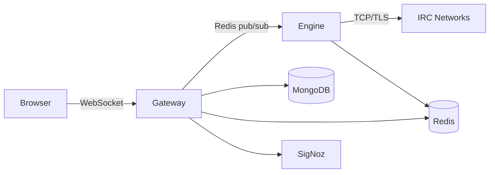

# IRC Fiber

Persistent IRC bouncer with a web client. Stay connected to multiple networks, replay history on reconnect, and manage everything from the browser.


<p align="center">
  <a href="https://github.com/user-attachments/assets/6720acd2-4c81-476f-ade8-c144bf9ada23">
    
  </a>
</p>

## Features

- **Always-on bouncer** — Engine holds IRC TCP/TLS, rejoins and replays via `CHATHISTORY` on reconnect
- **Web client** — Svelte 5 + Vite, IRCCloud-inspired layout, WebSocket live updates, member list, typing indicators
- **History** — MongoDB-backed scrollback with Redis dedup, lazy load and search
- **Multi-network** — One engine process per host, sharded by network, horizontal via `ServerRegistry`
- **Ops** — Admin SPA (`/admin`), SigNoz observability (traces/metrics/logs), Ansible deploys

## Architecture



- **Gateway** (`site/backend`): vibe.d HTTP/WS, auth, sessions (Redis 14d), static `public/dist`
- **Engine** (`engine`): D daemon, `connection.d` + `manager.d`, SASL, `CHATHISTORY`, reconnect backoff, `EngineJanitor` TTL
- **Common** (`site/common` + `engine/common` duplicated, `common/` reference): `redis/protocol.d`, `models/*`, `db/*`, `storage/*` — inter-service contract

## Repository layout

This is a **superproject**. Clone once with submodules:

```bash
git clone --recursive https://github.com/kevinpostal/IRC_FIBER.git
cd IRC_FIBER
ls site/   # kevinpostal/ircfiber-site   — frontend + gateway
ls engine/ # kevinpostal/ircfiber-engine — irc daemon
ls common/ # kevinpostal/ircfiber-common — shared lib (also inlined in site/engine)
git submodule update --init --recursive
git pull --recurse-submodules && git submodule update --remote
```

| Repo | Contains | Image |
|------|----------|-------|
| `ircfiber-site` | `frontend/`, `backend/`, `public/`, `common/` | `Containerfile.site` → `runtime-gateway` |
| `ircfiber-engine` | `engine/`, `common/`, `backend/dub.sdl` stub | `Containerfile.engine` → `runtime-engine` |
| `ircfiber-common` | `source/ircfiber/*`, `dub.sdl` | library |
| `IRC_FIBER` (this) | `site` + `engine` + `common` submodules, top-level `deploy/` | orchestration |

`common/` is duplicated inline in `site`/`engine` (Option A). Drift guard: `site/scripts/check-common-drift.sh --fetch` fails CI on drift. Future: `common` as versioned dub package `~>0.3.0`.

Monorepo history preserved at `pre-split-main` + tag `pre-split-2026-08-23`.

## Quick start

### Docker (full stack)

```bash
# from superproject or site/
cd site && docker compose up -d   # site: gateway + redis + mongo + ircd
cd ../engine && docker compose up -d # engine: irc daemon
# or superproject wrapper
docker compose -f site/docker-compose.yml -f engine/docker-compose.yml up -d
open http://localhost:8090
```

### Native

```bash
brew install ldc dub redis mongo
# site
cd site && ./scripts/generate-version.sh && npm --prefix frontend ci && npm --prefix frontend run build
dub --root=site/common build && dub --root=site/backend build
# engine
cd ../engine && ./scripts/generate-version.sh && dub --root=engine build
```

## Configuration

Copy `deploy/inventories/production/group_vars/vault.example.yml` → `vault.yml` (ansible-vault encrypted) and set `vault_ircfiber_admin_password`, `vault_mongo_*`, etc. Do not commit `vault.yml` or `deploy/.vault_pass.txt` (both gitignored). `deploy/inventories/production/hosts.ini.example` shows inventory shape; real `hosts.ini` stays private.

```
cp deploy/inventories/production/group_vars/vault.example.yml deploy/inventories/production/group_vars/vault.yml
ansible-vault edit deploy/inventories/production/group_vars/vault.yml
echo "my-vault-password" > deploy/.vault_pass.txt  # gitignored
```

`site/deploy/inventories/production/group_vars/all/vars.yml` now references `{{ vault_ircfiber_admin_password }}` — no hardcoded default.

## Deployment

Decoupled — site never restarts engine (holds TCP/TLS):

```bash
# site (gateway + frontend) — no engine touch
cd site && ansible-playbook deploy/playbooks/deploy-site.yml -l vps-efb4b52d

# engine — no gateway touch
cd engine && ansible-playbook deploy/playbooks/deploy-engine.yml -l vps-efb4b52d
```

Host: `vps-efb4b52d` → `/opt/ircfiber-site` (`Containerfile.site`) + `/opt/ircfiber-engine` (`Containerfile.engine`), gateway `Up` + `engine PID 7` stable. See `site/deploy/playbooks/deploy-site.yml` for BuildKit + `GIT_HASH` injection.

## Development

```bash
cd site
npm --prefix frontend test          # Vitest lib + client (Playwright)
npm --prefix frontend run test:watch
cd ../engine
dub --root=engine test
./site/scripts/check-common-drift.sh --fetch  # common drift guard

# local stack
cd site && make debug          # gateway :8090
cd ../engine && make engine-start  # engine :6667
```

## Editing `common/`

Edit in one repo, sync to the others:

```bash
# edit site/common/source/...
rsync -a site/common/ engine/common/
rsync -a site/common/ common/
site/scripts/check-common-drift.sh --fetch  # must be ✓
git -C site add common && git -C site commit -m "common: ..."
git -C engine add common && git -C engine commit -m "common: ..."
```

## Security

- Secrets via `ansible-vault` (`vault.yml` AES256, gitignored `.vault_pass.txt`). No plaintext passwords in repo.
- `.env.example` documents required env; `.env` gitignored.
- `deploy/local/docker-compose.yml` uses dev-only defaults (`signoz123`, `Admin123`) — not for production.

## License

MIT — see `site/backend/dub.sdl`, `site/common/dub.sdl`, `engine/dub.sdl`.

## Author

Kevin Postal — https://github.com/kevinpostal — built as a portfolio piece for infrastructure + systems work.
